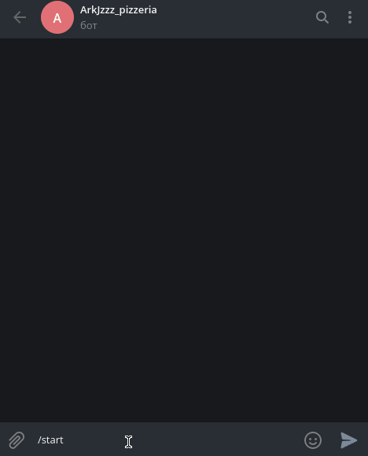
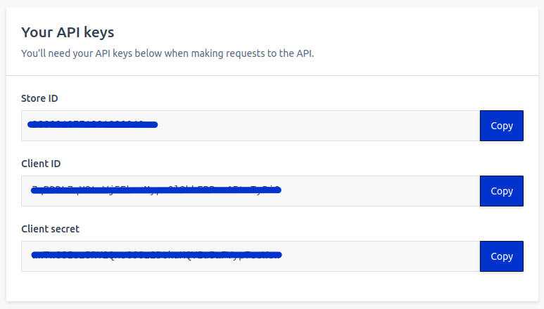
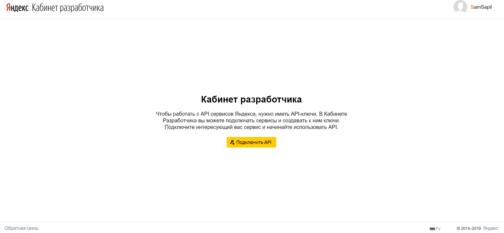
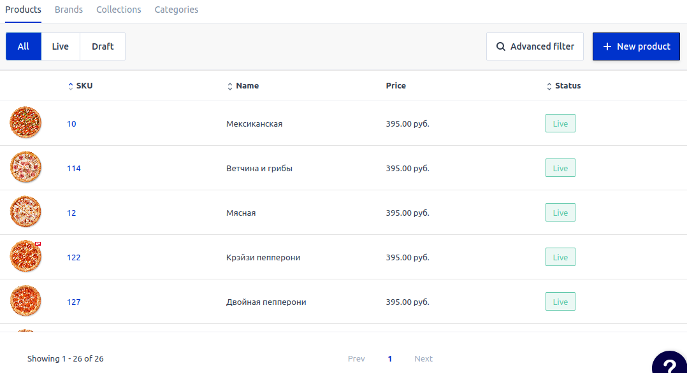
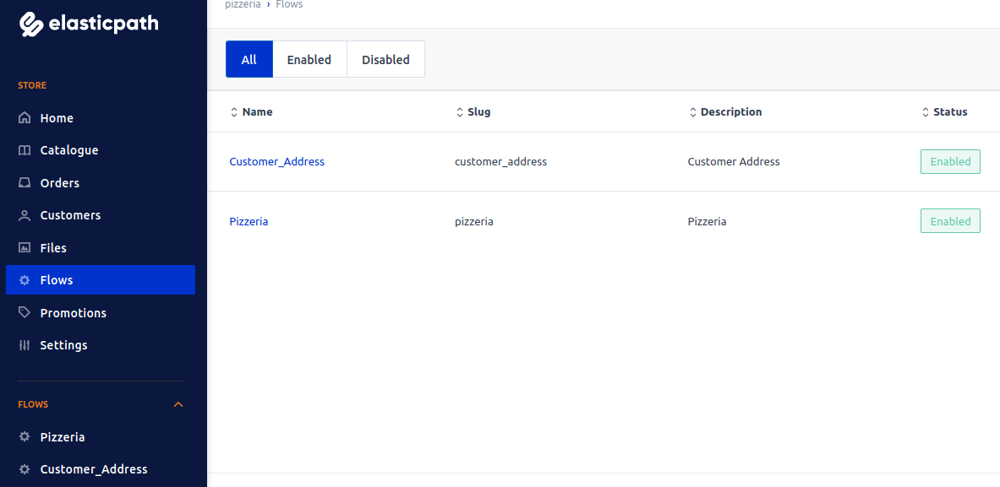

# pizza_shop

Бот-пиццерия для Telegram.




## Что используется 

- Работа с геоданными (telegram.Location, Yandex geocoder API, geopy)

- Прием платежей (ЮKassa, Сбербанк, Tranzzo)

- Очередь заданий [JobQueue](https://github.com/python-telegram-bot/python-telegram-bot/wiki/Extensions-%E2%80%93-JobQueue/0c79111ed68022f4936c2725f9827eac0a5240a0)

- Интеграция по API с CMS [Elastic Path](https://www.elasticpath.com/) (ранее Moltin)


## Подготовка

- **Подготовьте файлы с данными**
    
    Файл с меню: [menu.json](static/menu.json) 
    
    Файл с адресами пиццерий: [addresses.json](static/addresses.json)


- **Elastic Path**
    
    Зарегистрируйтесь на [Elastic Path](https://www.elasticpath.com/).

    Получите [ключи для доступа к API](https://dashboard.elasticpath.com/app).




- **Telegram**

    - Напишите [Отцу ботов](https://telegram.me/BotFather):

        ```
        /start
        ```

        ```
        /newbot
        ```

        Получите токен для доступа к API Telegram.

    - Получите токен оплаты в меню Payments у [Отца ботов](https://telegram.me/BotFather):

        ```
        /mybots
        ```
        
        выберите бота -> Payments -> выберите банк -> получите токен оплаты

        
        _Сбербанк и Яндекс.Касса выдают токены только для юридических лиц. Если вы не ИП и не хотите заморачиваться, выбирайте Tranzzo._


- **Redis**

    Зарегистрируйтесь на [redislabs](https://redislabs.com/).

    Получите адрес БД вида `redis-13965.f18.us-east-4-9.wc1.cloud.redislabs.com`, порт вида: `16635` и пароль.

- **API Яндекс-геокодера**
    
    получите API ключ в [кабинете разработчика](https://developer.tech.yandex.ru/):




## Установка

- Клонируйте репозиторий:
```
git clone https://github.com/ArkJzzz/pizza_shop.git
```

- Создайте файл ```.env``` и поместите в него токены Telegram, Payments, Elastic Path, API Яндекс-геокодера, а так же данные для доступа к Redis:
```
TELEGRAM_TOKEN=<Ваш токен>
TELEGRAM_ADMIN_CHAT_ID=<ID чата администратора магазина> (можно узнать, написав сообщение боту @userinfobot)

PAYMENTS_PROVIDER_TOKEN=<Токен оплаты>

ELASTICPATH_CLIENT_ID=<Client ID>
ELASTICPATH_CLIENT_SECRET=<Client secret>

REDIS_HOST=<Адрес БД>
REDIS_PORT=<Порт>
REDIS_DB=<Номер БД, по умолчанию 0>
REDIS_PASSWORD=<Пароль>

YANDEX_GEOCODER_API_KEY=<Ключ API Яндекс-геокодера>
```

- Установите зависимости:
```
pip3 install -r requirements.txt
```

## Запуск

**Инициализация пиццерии:**

```
python3 init_pizzeria.py
```

В результате выполнения этого скрипта [каталог товаров в Elastic Path](https://dashboard.elasticpath.com/app/catalogue/products) наполнится позициями из файла [menu.json](static/menu.json):



Так же создадутся две [модели](https://dashboard.elasticpath.com/app/flows):

- Модель `Pizzeria` с полями `Address`, `Alias`, `Longitude`, `Latitude`, `Delivery_man`. Эта модель наполнится адресами пиццерий  из [addresses.json](static/addresses.json). 

    _Внимание! По-умолчанию в поле `Delivery_man` устанавливается id чата администратора канала, необходимо будет вручную указать id чата доставщика в CMS Elastic Path_


- Модель `Customer Address` с полями `telegram_id`, `phone`, `latitude` и `longitude`. Эта модель будет наполняться данными клиентов при заказе.




**Запуск бота-пиццерии:**

```
python3 tg_pizza_shop.py
```

**Как запускать на сервере:**

- шпаргалка по деплою на [Heroku](https://github.com/ArkJzzz/heroku_deploy)
- шпаргалка по деплою на [удаленном сервере с Ubuntu](https://github.com/ArkJzzz/remote_server_deploy.git)

------
Демонстрационный бот-пиццерия: [@ArkJzzz_pizzeria_bot](https://telegram.me/ArkJzzz_pizzeria_bot)